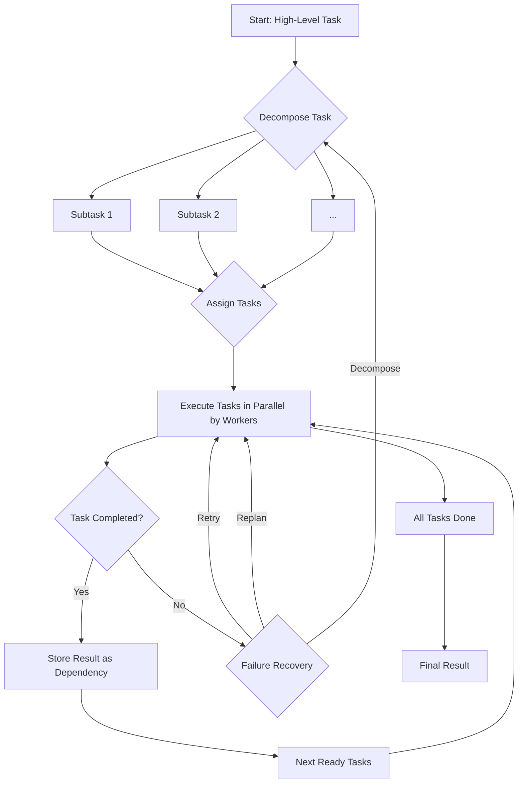

# Workforce - Lực lượng lao động

Workforce là công cụ cộng tác đa tác nhân mạnh mẽ của CAMEL-AI. Nó cho phép bạn xây dựng, quản lý và mở rộng quy mô các nhóm AI Agent để giải quyết những nhiệm vụ phức tạp vượt quá khả năng của một agent đơn lẻ. Bằng cách tạo ra một "workforce" gồm các agent chuyên biệt, bạn có thể tự động hóa các quy trình làm việc phức tạp, thúc đẩy thực thi song song và đạt được các giải pháp mạnh mẽ và thông minh hơn.

## Khám phá chuyên sâu các thành phần cốt lõi

### The Workforce Class 

Lớp `Workforce` là bộ điều phối trung tâm. Nó quản lý toàn bộ vòng đời của một tác vụ đa Agent.

```python
class Workforce(BaseNode):
    def __init__(
        self,
        description: str,
        children: Optional[List[BaseNode]] = None,
        coordinator_agent: Optional[ChatAgent] = None,
        task_agent: Optional[ChatAgent] = None,
        new_worker_agent: Optional[ChatAgent] = None,
        graceful_shutdown_timeout: float = 15.0,
        task_timeout_seconds: Optional[float] = None,
        share_memory: bool = False,
        use_structured_output_handler: bool = True,
        callbacks: Optional[List[WorkforceCallback]] = None,
    ) -> None:
    # ...

```

**Key Parameters:**

- `description` : Mô tả cấp cao về mục đích của lực lượng lao động.
- `children` : Danh sách các nút worker ban đầu.
- `coordinator_agent` : Một `ChatAgent` để phân công tác vụ.
- `task_agent` : Một `ChatAgent` để chia nhỏ tác vụ.
- `new_worker_agent` : Một `ChatAgent` mẫu để tạo các worker mới.
- `task_timeout_seconds` : Thời gian chờ tùy chọn cho mỗi tác vụ của lực lượng lao động, tính bằng giây.
- `share_memory` : Nếu `True` , các phiên bản SingleAgentWorker sẽ chia sẻ bộ nhớ.
- `use_structured_output_handler` : Mặc định là `True` . Bật tính năng xử lý đầu ra có cấu trúc để các mô hình không hỗ trợ JSON + gọi công cụ (tool-calling) gốc vẫn có thể tương tác đáng tin cậy.
- `callbacks` : Tùy chọn là một danh sách các trình xử lý callback để quan sát và ghi lại các sự kiện cũng như số liệu về vòng đời của lực lượng lao động.

**Worker Types**
Lực lượng lao động (Workforce) có thể bao gồm nhiều loại worker khác nhau, mỗi loại phù hợp với các dạng tác vụ riêng biệt.

- `SingleAgentWorker`: Đây là loại worker phổ biến nhất. Nó bao gồm một `ChatAgent` duy nhất được cấu hình với các công cụ cụ thể và một system prompt. Để tối ưu hiệu suất, nó sử dụng một `AgentPool` nhằm tái sử dụng các phiên bản agent.
- `RolePlayingWorker`: Worker này sử dụng một phiên `RolePlaying` giữa hai agent (một trợ lý và một người dùng) để hoàn thành nhiệm vụ. Nó hữu ích cho việc động não, tranh luận hoặc khám phá một chủ đề từ nhiều góc độ khác nhau.

### Creating and Adding Workers

- **SingleAgentWorker** Examples

Dưới đây là các ví dụ chi tiết về cách tạo và thêm các phiên bản SingleAgentWorker vào lực lượng lao động của bạn.

**Simple worker**

```python
from camel.societies.workforce import Workforce
from camel.agents import ChatAgent

workforce = Workforce("My Research Team")

# Create a general-purpose agent
general_agent = ChatAgent(system_message="You are a helpful research assistant.")

# Add the worker
workforce.add_single_agent_worker(
    description="A worker for general research tasks",
    worker=general_agent,
)
```

**Worker with tools**

```python
from camel.societies.workforce import Workforce
from camel.agents import ChatAgent
from camel.toolkits import SearchToolkit

workforce = Workforce("Web Research Team")

# Create a search agent with a web search tool
search_agent = ChatAgent(
    system_message="A research assistant that can search the web.",
    tools=[SearchToolkit().search_duckduckgo]
)

# Add the worker
workforce.add_single_agent_worker(
    description="A worker that can perform web searches",
    worker=search_agent,
)
```

**Worker with a specific Model**

```python
from camel.societies.workforce import Workforce
from camel.agents import ChatAgent
from camel.models import ModelFactory
from camel.types import ModelType

workforce = Workforce("Creative Writing Team")

# Create an agent with a specific model for creative tasks
creative_model = ModelFactory.create(model_type=ModelType.GPT_5_MINI)
creative_agent = ChatAgent(
    system_message="A creative writer for generating stories.",
    model=creative_model
)

# Add the worker
workforce.add_single_agent_worker(
    description="A worker for creative writing",
    worker=creative_agent,
)
```

- **RolePlayingWorker** Example

Ví dụ này thiết lập một phiên đóng vai giữa một "solution architect" và một "software developer" để thiết kế một hệ thống.

```python
from camel.societies.workforce import Workforce

workforce = Workforce("System Design Team")

workforce.add_role_playing_worker(
    description="A role-playing session for system design.",
    assistant_role_name="Software Developer",
    user_role_name="Solution Architect",
    assistant_agent_kwargs=dict(
        system_message="You are a software developer responsible for implementing the system."
    ),
    user_agent_kwargs=dict(
        system_message="You are a solution architect responsible for the high-level design."
    ),
    chat_turn_limit=5,
)

# ... process a task with this workforce ...
```

- **Task Lifecycle and Management**

Workforce quản lý một vòng đời tác vụ tinh vi.




- **Decomposition**: Phân rã: `task_agent` chia nhỏ nhiệm vụ chính thành các nhiệm vụ phụ nhỏ hơn, độc lập.
- **Assignment**: `coordinator_agent` phân công từng nhiệm vụ con cho worker phù hợp nhất.
- **Execution**: Các worker thực hiện các nhiệm vụ được giao, thường là song song.
- **Completion**: Kết quả của một nhiệm vụ được lưu trữ và có thể được sử dụng làm dependency cho các nhiệm vụ khác.
- **Failure Handling**: Nếu một tác vụ thất bại, Workforce sẽ khởi động các giao thức khôi phục của nó.

---

#### **Advanced Usage: Human-in-the-Loop (HITL)**

Để kích hoạt `HITL` bên trong một Workforce, hãy trang bị cho các agent (coordinator, task agent hoặc workers) bằng `HumanToolkit` . 

Các agent sau đó có thể gọi con người trong quá trình thực thi (ví dụ: để làm rõ yêu cầu, phê duyệt hành động hoặc gỡ lỗi).

```python
from camel.societies.workforce import Workforce
from camel.agents import ChatAgent
from camel.toolkits import HumanToolkit

# 1) Create the workforce
workforce = Workforce("Interactive Workforce")

# 2) Prepare human-in-the-loop tools
human_toolkit = HumanToolkit()
human_tools = human_toolkit.get_tools()  # includes ask_human_via_console, send_message_to_user, ...

# 3) Attach HumanToolkit to any agents that may need human help
coordinator = ChatAgent(
    system_message="You coordinate tasks and may ask a human for help when needed.",
    tools=human_tools,
)

worker = ChatAgent(
    system_message="You execute tasks and can ask the human for clarification.",
    tools=[human_toolkit.ask_human_via_console],  # or use `human_tools`
)

# 4) Register agents into the workforce
workforce = Workforce(
    description="Interactive Workforce",
    coordinator_agent=coordinator,
    task_agent=None,
)
workforce.add_single_agent_worker(description="Worker", worker=worker)

# 5) Run tasks as usual. When an agent invokes a human tool, it will prompt via console.
# workforce.process_task(Task(content="Build a quick demo and confirm requirements with the human."))
```


**Notes**:
- Không cần xử lý luồng đặc biệt. Các Agent sẽ nhắc người dùng khi họ gọi một công cụ `HumanToolkit` .
- Nếu bạn cần điều khiển bất đồng bộ, `process_task_async` có sẵn, nhưng không bắt buộc đối với `HITL`.

---

#### Key Data Structures  Các Cấu trúc Dữ liệu Chính

Mô-đun workforce sử dụng nhiều mô hình `Pydantic` để đảm bảo trao đổi dữ liệu có cấu trúc.

- `WorkerConf` : Xác định cấu hình cho một worker mới.
- `TaskResult` : Đại diện cho đầu ra của một nhiệm vụ đã hoàn thành.
- `TaskAssignment` : Một phép gán nhiệm vụ duy nhất cho worker, bao gồm các phụ thuộc.
- `TaskAssignResult` : Một danh sách các đối tượng `TaskAssignment` .
- `RecoveryDecision` : Đầu ra của quy trình phân tích lỗi, chỉ định chiến lược khôi phục.

Việc hiểu các mô hình này là chìa khóa để diễn giải trạng thái nội bộ và nhật ký của lực lượng lao động.
